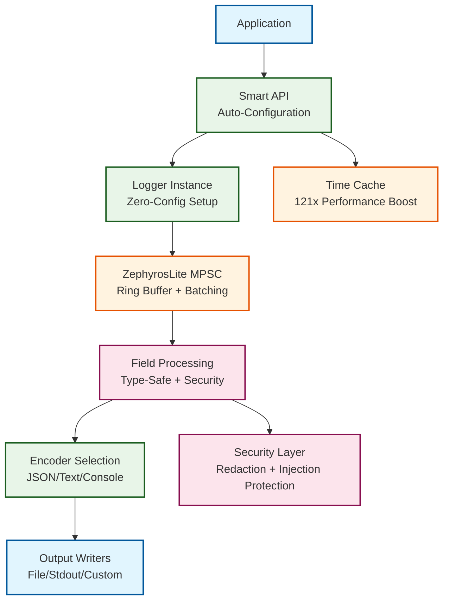

# Iris — High-Performance Structured Logging for Go
### an AGILira fragment

Iris is an ultra-high performance, zero-allocation structured logging library for Go, built for applications that demand maximum throughput, enterprise security, and production-grade reliability — without compromising developer experience.

[](https://github.com/agilira/iris/actions/workflows/ci.yml)
[](https://github.com/agilira/iris/actions/workflows/ci.yml)
[](https://goreportcard.com/report/github.com/agilira/iris)
[](https://codecov.io/gh/agilira/iris)


### Key Features
- **Smart API**: Zero-configuration setup with automatic optimization for your environment
- **SyncReader Interface**: Extensible architecture for integrating with existing logging libraries
- **SyncWriter Interface**: Modular output destinations with external writer modules
- **Intelligent Auto-Scaling**: Real-time switching between SingleRing and MPSC modes based on workload
- **Modular Ecosystem**: External providers and writers with zero core dependencies
- **Professional Security**: Built-in sensitive data redaction and log injection protection
- **OpenTelemetry Integration**: Native distributed tracing with automatic correlation and baggage propagation
- **Hot Reload Configuration**: Runtime configuration changes without service restarts
- **Advanced Idle Strategies**: Progressive, spinning, sleeping, and hybrid strategies for optimal CPU usage
- **Backpressure Policies**: Intelligent handling of high-load scenarios with multiple strategies

### Modular Architecture
Iris uses a modular design with external packages for integrations:
- **Providers**: `iris-provider-slog` for Go's log/slog integration
- **Writers**: `iris-writer-loki` for Grafana Loki output
- **Zero Dependencies**: Core library remains dependency-free

**[Provider Ecosystem →](./docs/PROVIDER_ECOSYSTEM.md)** | **[Writer Development →](./docs/WRITER_DEVELOPMENT.md)**

## Installation

```bash
go get github.com/agilira/iris
```

## Quick Start

```go
import "github.com/agilira/iris"

// Smart API automatically configures everything optimally
logger, err := iris.New(iris.Config{})
if err != nil {
    panic(err)
}
defer logger.Sync()

logger.Start()

// Zero-allocation structured logging
logger.Info("User authenticated", 
    iris.Str("user_id", "12345"),
    iris.Dur("response_time", time.Millisecond*150),
    iris.Secret("api_key", apiKey))  // Automatically redacted
```

**[Complete Quick Start Guide →](./docs/QUICK_START.md)** - Get running in 2 minutes with detailed examples
**[Provider Integration Guide →](./docs/READERLOGGER_INTEGRATION.md)** - Accelerate existing applications

## Performance

Iris prioritizes performance without sacrificing developer experience. Through careful engineering of zero-allocation field encoding, intelligent time caching, and lock-free ring buffers, we've achieved consistent sub-50ns logging operations.

Logging a message and 10 fields:

| Package | Time | Time % to iris | Objects Allocated |
| :------ | ---: | -------------: | ----------------: |
| **iris** | **31 ns/op** | **+0%** | **0 allocs/op** |
| zerolog | 63 ns/op | +103% | 0 allocs/op |
| zap | 442 ns/op | +1,326% | 1 allocs/op |
| slog | 662 ns/op | +2,035% | 11 allocs/op |
| go-kit | 1,871 ns/op | +5,935% | 36 allocs/op |
| apex/log | 5,771 ns/op | +18,519% | 35 allocs/op |
| log15 | 7,196 ns/op | +23,084% | 42 allocs/op |
| logrus | 7,579 ns/op | +24,316% | 52 allocs/op |

Logging with accumulated context (10 fields already present):

| Package | Time | Time % to iris | Objects Allocated |
| :------ | ---: | -------------: | ----------------: |
| **iris** | **25 ns/op** | **+0%** | **0 allocs/op** |
| zerolog | 25 ns/op | +0% | 0 allocs/op |
| zap | 103 ns/op | +312% | 0 allocs/op |
| slog | 167 ns/op | +568% | 0 allocs/op |
| go-kit | 895 ns/op | +3,480% | 19 allocs/op |
| apex/log | 2,796 ns/op | +11,084% | 13 allocs/op |
| log15 | 3,402 ns/op | +13,508% | 23 allocs/op |
| logrus | 5,394 ns/op | +21,476% | 35 allocs/op |

Adding fields at log site:

| Package | Time | Time % to iris | Objects Allocated |
| :------ | ---: | -------------: | ----------------: |
| **iris** | **30 ns/op** | **+0%** | **0 allocs/op** |
| zerolog | 69 ns/op | +130% | 0 allocs/op |
| zap | 334 ns/op | +1,013% | 1 allocs/op |
| slog | 543 ns/op | +1,710% | 7 allocs/op |
| go-kit | 1,376 ns/op | +4,487% | 28 allocs/op |
| apex/log | 4,186 ns/op | +13,853% | 24 allocs/op |
| log15 | 5,372 ns/op | +17,807% | 34 allocs/op |
| logrus | 6,280 ns/op | +20,833% | 40 allocs/op |

## Architecture

Iris provides intelligent logging through Smart API optimization and security-first design:



### SyncReader Integration

Iris provides a SyncReader interface for integrating with existing logging libraries through external provider modules:

```go
// Example with slog provider
import slogprovider "github.com/agilira/iris-provider-slog"

provider := slogprovider.New(slogprovider.Config{})
logger := slog.New(provider)  // Same slog API, enhanced performance
```

**[Provider Integration Guide →](./docs/READERLOGGER_INTEGRATION.md)** | **[Provider Development →](./docs/PROVIDER_DEVELOPMENT_GUIDE.md)**

### Advanced Features

**Auto-Scaling Architecture:**
- **SingleRing Mode**: 25ns/op for low-contention scenarios
- **MPSC Mode**: 35ns/op per thread for high-contention workloads  
- **Automatic switching** based on write frequency, contention, latency, and goroutine count
- **Real-time metrics** for optimal performance monitoring

**OpenTelemetry Integration:**
- **Automatic trace correlation** with trace_id and span_id extraction
- **Baggage propagation** for distributed context across services
- **Resource detection** for service name, version, and environment
- **Zero-allocation performance** using Iris's ContextExtractor pattern

**Idle Strategies:**
- **Progressive Strategy**: Adaptive CPU usage (default, auto-optimized)
- **Spinning Strategy**: Ultra-low latency with maximum CPU usage
- **Sleeping Strategy**: Minimal CPU usage for low-throughput scenarios
- **Hybrid Strategy**: Balanced approach with brief spinning then sleep

**Hot Reload Configuration:**
- **Runtime updates** without service restarts
- **Comprehensive audit trails** for compliance and security
- **Multi-format support** for flexible configuration management
- **Production-ready** with graceful error handling and fallbacks


## Core Framework

### Smart API - Zero Configuration
Auto-detection and configuration of architecture, capacity, encoder, and logging level without any setup.

### Security-First Design
- **Secret Redaction**: Automatic masking of sensitive data (passwords, API keys, tokens)
- **Injection Protection**: Complete defense against log manipulation attacks
- **Field Sanitization**: Safe handling of user input and dynamic keys

### Multi-Format Output
- **JSON**: Structured logging for production systems and log aggregation
- **Text**: Human-readable format for development and debugging
- **Console**: Color-coded output with intelligent TTY detection

### Field Type System
- **Type-Safe Constructors**: Strongly typed field creation (String, Int64, Duration, etc.)
- **Union Storage**: Memory-efficient field storage with type indicators
- **Extensible Design**: Support for custom types and serialization

```go
// Type-safe field construction with automatic security
logger.Info("Payment processed",
    iris.Str("transaction_id", "tx-123456"),
    iris.Int64("amount_cents", 2499),
    iris.Dur("processing_time", time.Millisecond*45),
    iris.Secret("card_number", cardNumber),  // Automatically redacted
)

// Output (JSON): {"ts":"2025-09-03T10:00:00Z","level":"info","msg":"Payment processed","transaction_id":"tx-123456","amount_cents":2499,"processing_time":"45ms","card_number":"[REDACTED]"}
```

**Performance**: 324-537 ns/op encoding with 0 allocations per field

**[Auto-Scaling Architecture →](./docs/AUTOSCALING_ARCHITECTURE.md)** | **[OpenTelemetry Integration →](./docs/OPENTELEMETRY.md)**

## The Philosophy Behind Iris

In Greek mythology, Iris was the personification of the rainbow and divine messenger of the gods, beloved wife of Zephyros, the swiftest and gentlest of the Anemoi. Together, they embodied perfect partnership: Zephyros as the carrier of velocity and power, Iris as the guardian of beauty and truth. When they worked in harmony, messages crossed the heavens with unprecedented speed while maintaining their radiant clarity and divine fidelity.

Iris and Zephyros work together within every log operation—Zephyros provides the velocity that moves your messages in mere nanoseconds across any distance, while Iris ensures each log maintains its integrity, security, and meaning. Neither works alone; they are unified in purpose.

## Documentation

**Quick Links:**
- **[Quick Start Guide](./docs/QUICK_START.md)** - Get running in 2 minutes
- **[SyncReader Interface](./docs/SYNCREADER_INTERFACE.md)** - Universal logging acceleration
- **[Provider Integration Guide](./docs/READERLOGGER_INTEGRATION.md)** - Accelerate existing applications
- **[Provider Development Guide](./docs/PROVIDER_DEVELOPMENT_GUIDE.md)** - Create new provider modules
- **[Writer Development Guide](./docs/WRITER_DEVELOPMENT.md)** - Create external writer modules
- **[Provider Ecosystem](./docs/PROVIDER_ECOSYSTEM.md)** - Architecture and maintenance model
- **[SyncReader Troubleshooting](./docs/SYNCREADER_TROUBLESHOOTING.md)** - Diagnostic and debugging guide
- **[Grafana Loki Integration](./docs/LOKI_INTEGRATION.md)** - High-performance logging to Loki
- **[Auto-Scaling Architecture](./docs/AUTOSCALING_ARCHITECTURE.md)** - Intelligent performance optimization
- **[OpenTelemetry Integration](./docs/OPENTELEMETRY.md)** - Distributed tracing and observability
- **[Hot Reload Configuration](./docs/HOT_RELOAD.md)** - Runtime configuration management
- **[Smart API Guide](./docs/SMART_API.md)** - Zero-configuration setup and auto-optimization
- **[Security Reference](./docs/SECURE_BY_DESIGN.md)** - Complete security features guide
- **[Log Sampling](./docs/SAMPLER.md)** - Rate limiting and volume control for high-throughput scenarios
- **[Context Integration](./docs/CONTEXT_INTEGRATION.md)** - Advanced context handling patterns
- **[Idle Strategies Guide](./docs/IDLE_STRATEGIES_GUIDE.md)** - CPU optimization and workload adaptation
- **[Backpressure Policies](./docs/BACKPRESSURE_POLICIES.md)** - High-load scenario handling
- **[Examples](./examples/)** - Production-ready logging patterns

## License

Iris is licensed under the [Mozilla Public License 2.0](./LICENSE.md).

---

Iris • an AGILira fragment
