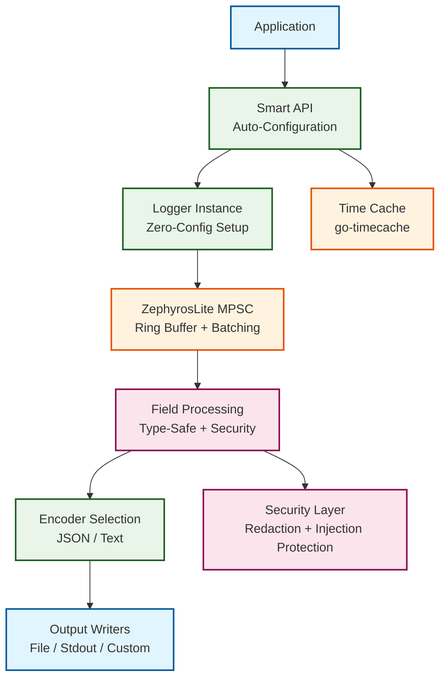

# Iris — Structured Logging at Wind Speed for Go
### an AGILira fragment

Iris is a blazing-fast, zero-allocation structured logging library for Go, engineered for applications that demand maximum throughput, built-in security, and production-grade reliability — without compromising developer experience.

[](https://github.com/agilira/iris/actions/workflows/ci.yml)
[](https://github.com/agilira/iris/actions/workflows/ci.yml)
[](https://goreportcard.com/report/github.com/agilira/iris)
[](https://codecov.io/gh/agilira/iris)


### Key Features
- **Smart API**: Zero-configuration setup with automatic optimization for your environment
- **SyncReader Interface**: Extensible architecture for integrating external log sources
- **SyncWriter Interface**: Modular output destinations with external writer modules
- **Intelligent Auto-Scaling**: Real-time switching between SingleRing and ThreadedRings modes based on workload
- **Built-In Security**: Sensitive data redaction, log injection protection, and key sanitization
- **Advanced Idle Strategies**: Progressive, spinning, sleeping, yielding, and channel strategies for optimal CPU usage
- **Backpressure Policies**: Drop-on-full or block-on-full handling for high-load scenarios
- **OnDrop Forensic Callback**: Real-time notification when log entries are dropped (CWE-778 detection)
- **Token-Bucket Sampling**: Rate-limiting for high-volume logging with configurable capacity and refill
- **Context Integration**: First-class context.Context support with key extraction and field propagation

### Modular Architecture
Iris uses a modular design with external packages for integrations. **Currently available:**
- **Providers**: [`iris-provider-slog`](https://github.com/agilira/iris-provider-slog) for Go's log/slog integration

## Installation

```bash
go get github.com/agilira/iris
```

## Quick Start

```go
import "github.com/agilira/iris"

// Smart API automatically configures everything optimally
logger, err := iris.New(iris.Config{})
if err != nil {
    panic(err)
}
defer logger.Sync()

logger.Start()

// Zero-allocation structured logging
logger.Info("User authenticated",
    iris.Str("user_id", "12345"),
    iris.Dur("response_time", time.Millisecond*150),
    iris.Secret("api_key", apiKey))  // Automatically redacted
```

## Performance

Iris prioritizes performance without sacrificing developer experience. Through careful engineering of zero-allocation field encoding, cached time sources, and lock-free ring buffers, we achieve consistent sub-35ns logging operations.

Benchmark environment: AMD Ryzen 5 7520U, Go 1.24.5, linux/amd64, SingleRing architecture.

Logging a message and 10 fields:

| Package | Time | Time % to iris | Objects Allocated |
| :------ | ---: | -------------: | ----------------: |
| **iris** | **34 ns/op** | **+0%** | **0 allocs/op** |
| zerolog | 53 ns/op | +56% | 0 allocs/op |
| zap | 429 ns/op | +1,162% | 1 allocs/op |
| slog | 689 ns/op | +1,926% | 11 allocs/op |
| go-kit | 2,516 ns/op | +7,300% | 36 allocs/op |
| apex/log | 5,690 ns/op | +16,635% | 35 allocs/op |
| logrus | 9,904 ns/op | +29,012% | 52 allocs/op |
| log15 | 10,062 ns/op | +29,476% | 42 allocs/op |

Logging with accumulated context (6 fields already present):

| Package | Time | Time % to iris | Objects Allocated |
| :------ | ---: | -------------: | ----------------: |
| **iris** | **25 ns/op** | **+0%** | **0 allocs/op** |
| zerolog | 27 ns/op | +8% | 0 allocs/op |
| zap | 100 ns/op | +300% | 0 allocs/op |
| slog | 157 ns/op | +528% | 0 allocs/op |
| go-kit | 1,179 ns/op | +4,616% | 19 allocs/op |
| apex/log | 2,801 ns/op | +11,104% | 13 allocs/op |
| log15 | 4,240 ns/op | +16,860% | 23 allocs/op |
| logrus | 5,262 ns/op | +20,948% | 35 allocs/op |

Adding fields at log site (6 fields):

| Package | Time | Time % to iris | Objects Allocated |
| :------ | ---: | -------------: | ----------------: |
| **iris** | **31 ns/op** | **+0%** | **0 allocs/op** |
| zerolog | 75 ns/op | +142% | 0 allocs/op |
| zap | 330 ns/op | +965% | 1 allocs/op |
| slog | 571 ns/op | +1,742% | 7 allocs/op |
| go-kit | 1,442 ns/op | +4,552% | 28 allocs/op |
| apex/log | 4,129 ns/op | +13,219% | 24 allocs/op |
| logrus | 6,106 ns/op | +19,597% | 40 allocs/op |
| log15 | 7,821 ns/op | +25,132% | 34 allocs/op |

## Architecture

Iris provides intelligent logging through Smart API optimization and security-first design:


```mermaid
graph TD
    A[Application] --> B[Smart API<br/>Auto-Configuration]
    B --> C[Logger Instance<br/>Zero-Config Setup]
    C --> D[ZephyrosLite MPSC<br/>Ring Buffer + Batching]
    D --> E[Field Processing<br/>Type-Safe + Security]
    E --> F[Encoder Selection<br/>JSON / Text]
    F --> G[Output Writers<br/>File / Stdout / Custom]
    E --> H[Security Layer<br/>Redaction + Injection Protection]
    B --> I[Time Cache<br/>go-timecache]

    classDef primary fill:#e1f5fe,stroke:#01579b,stroke-width:2px
    classDef secondary fill:#e8f5e8,stroke:#1b5e20,stroke-width:2px
    classDef security fill:#fce4ec,stroke:#880e4f,stroke-width:2px
    classDef performance fill:#fff3e0,stroke:#e65100,stroke-width:2px

    class A,G primary
    class B,C,F secondary
    class E,H security
    class D,I performance
```

### SyncReader Integration

Iris provides a SyncReader interface for integrating with existing logging libraries through external provider modules:

```go
// Example with slog provider
import slogprovider "github.com/agilira/iris-provider-slog"

provider := slogprovider.New(slogprovider.Config{})
logger := slog.New(provider)  // Same slog API, iris performance
```

### Advanced Features

**Auto-Scaling Architecture:**
- **SingleRing Mode**: ~29 ns/op for low-contention scenarios
- **ThreadedRings Mode**: ~35 ns/op per thread for high-contention workloads
- **Automatic switching** based on write frequency, contention, latency, and goroutine count
- **Real-time metrics** via `logger.Stats()` for performance monitoring

**Idle Strategies:**
- **Progressive Strategy**: Adaptive CPU usage (default)
- **Spinning Strategy**: Ultra-low latency, maximum CPU usage
- **Sleeping Strategy**: Minimal CPU usage for low-throughput scenarios
- **Yielding Strategy**: Moderate CPU reduction via runtime.Gosched()
- **Channel Strategy**: Event-driven wake-up for minimal CPU footprint


## Core Framework

### Smart API - Zero Configuration
Auto-detection and configuration of architecture, capacity, encoder, and logging level without any setup.

### Security-First Design
- **Secret Redaction**: Automatic masking of sensitive data (passwords, API keys, tokens)
- **Injection Protection**: Complete defense against log manipulation attacks (CWE-93, CWE-116)
- **Field Key Sanitization**: All keys pass through quoteString() -- no raw writes to output
- **Input Validation**: Config.Validate() enforced at construction with capacity ceiling (CWE-400)
- **Drop Detection**: OnDrop callback for real-time log-flooding attack detection (CWE-778)

### Multi-Format Output
- **JSON**: Structured logging for production systems and log aggregation
- **Text**: Human-readable format for development and debugging

### Field Type System
- **Type-Safe Constructors**: Strongly typed field creation (Str, Int64, Dur, etc.)
- **Union Storage**: Memory-efficient field storage with type indicators
- **Secret Fields**: Automatic redaction in all encoder output

```go
// Type-safe field construction with automatic security
logger.Info("Payment processed",
    iris.Str("transaction_id", "tx-123456"),
    iris.Int64("amount_cents", 2499),
    iris.Dur("processing_time", time.Millisecond*45),
    iris.Secret("card_number", cardNumber),  // Automatically redacted
)

// Output (JSON): {"ts":"...","level":"info","msg":"Payment processed","transaction_id":"tx-123456","amount_cents":2499,"processing_time":"45ms","card_number":"[REDACTED]"}
```

## The Philosophy Behind Iris

In Greek mythology, Iris was the personification of the rainbow and divine messenger of the gods, beloved wife of Zephyros, the swiftest and gentlest of the Anemoi. Together, they embodied perfect partnership: Zephyros as the carrier of velocity and power, Iris as the guardian of beauty and truth. When they worked in harmony, messages crossed the heavens with unprecedented speed while maintaining their radiant clarity and divine fidelity.

Iris and Zephyros work together within every log operation -- Zephyros provides the velocity that moves your messages in mere nanoseconds across any distance, while Iris ensures each log maintains its integrity, security, and meaning. Neither works alone; they are unified in purpose.

## Documentation

**Quick Links:**
- **[Quick Start Guide](./docs/QUICK_START.md)** - Get running in 2 minutes
- **[Smart API Guide](./docs/SMART_API.md)** - Zero-configuration setup and auto-optimization
- **[Auto-Scaling Architecture](./docs/AUTOSCALING_ARCHITECTURE.md)** - Intelligent performance optimization
- **[Security Reference](./docs/SECURE_BY_DESIGN.md)** - Complete security features guide
- **[Log Sampling](./docs/SAMPLER.md)** - Rate limiting and volume control for high-throughput scenarios
- **[Context Integration](./docs/CONTEXT_INTEGRATION.md)** - Advanced context handling patterns
- **[Idle Strategies Guide](./docs/IDLE_STRATEGIES_GUIDE.md)** - CPU optimization and workload adaptation
- **[Backpressure Policies](./docs/BACKPRESSURE_POLICIES.md)** - High-load scenario handling
- **[Encoder Reference](./docs/ENCODERS.md)** - JSON and text encoder details
- **[Architecture Overview](./docs/ARCHITECTURE.md)** - Internal design and ring buffer architecture

## License

Iris is licensed under the [Mozilla Public License 2.0](./LICENSE.md).

---

Iris - an AGILira fragment
