# Iris Architecture

## Overview

Iris is an ultra-high performance structured logging library for Go, designed to be fast and secure while maintaining zero allocations and providing comprehensive features for production environments. The architecture is built around the embedded Zephyros MPSC ring buffer system, advanced field serialization, and intelligent performance optimizations. Iris challenges the performance of industry-standard loggers while offering advanced usability and feature completeness.

## System Architecture

### Design Principles

1. **Zero-Allocation Hot Paths**: No memory allocations during critical logging operations
2. **Lock-Free MPSC Ring Buffer**: Multi-producer, single-consumer architecture for maximum throughput
3. **Adaptive Performance**: Single-ring for maximum single-thread performance, threaded-rings for multi-producer scaling
4. **Type-Safe Structured Logging**: Compile-time type safety with runtime flexibility
5. **Encoder Abstraction**: Pluggable output formats (JSON, console, binary text)
6. **Security by Design**: Built-in protection against log injection and sensitive data exposure
7. **Production-Ready Features**: Comprehensive configuration, monitoring, and operational capabilities

## Module Structure

### Core Components (`iris.go`)

- `Logger`: Main logging interface with structured field support and contextual logging
- `Config`: Comprehensive configuration with intelligent defaults and validation
- `Level`: Atomic log level management with runtime adjustability
- `Field`: Type-safe structured field system with union-based storage

### Ring Buffer System (`ring.go`, `internal/zephyroslite/`)

Embedded Zephyros MPSC ring buffer providing ultra-low latency logging with two architectural modes:
- **SingleRing**: Optimized for single-producer scenarios (~25ns/op)
- **ThreadedRings**: Multi-producer scaling with excellent concurrency (~35ns/op)

### Field System (`field.go`)

Comprehensive type system supporting:
- **Primitive types** (string, int64, uint64, float64, bool)
- **Temporal types** (time.Time, time.Duration)
- **Complex types** ([]byte, error, fmt.Stringer, arbitrary objects)
- **Security features** (redacted secrets, safe error handling)

### Encoder Ecosystem (`encoder-*.go`)

- **JSONEncoder**: High-performance NDJSON with intelligent time caching
- **ConsoleEncoder**: Human-readable output with optional ANSI colors
- **Extensible Interface**: Support for binary and custom formats

### Buffer Pool System (`internal/bufferpool/`)

Zero-allocation buffer management with intelligent sizing and reuse strategies.

## Detailed Architecture Diagram

> **Diagram Legend:**
> - **Solid arrows (→)**: Primary data flow and synchronous operations
> - **Dashed arrows (-.)**: Asynchronous processing and optional paths
> - **Color coding**: Functional layers with performance characteristics
> - **Performance metrics**: Actual benchmarks from production testing

```mermaid
graph TB
    subgraph "Application Layer"
        APP[Application Code]
        CTX[Context Handling]
        MDW[Middleware]
    end

    subgraph "Iris Public API"
        LOGGER[Logger Interface]
        WITH[With Context]
        LEVEL[Level Management]
        SMART[Smart API]
    end

    subgraph "Field System"
        FIELD[Field Construction]
        TYPES[Type System]
        VALIDATE[Validation]
        SECRET[Security Features]
    end

    subgraph "Configuration"
        CONFIG[Config Struct]
        LOADER[Config Loader]
        ARCH[Architecture Choice]
        BACKP[Backpressure Policy]
    end

    subgraph "Core Processing"
        RECORD[Record Creation]
        SAMPLING[Sampling System]
        ENCODER[Encoder Selection]
        BUFFER[Buffer Pool]
    end

    subgraph "Ring Buffer System"
        SR[Single Ring]
        TR[Threaded Rings]
        POLICY[Backpressure]
        IDLE[Idle Strategies]
    end

    subgraph "Encoders"
        JSON[JSON Encoder]
        CONSOLE[Console Encoder]
        FUTURE[Future Encoders]
    end

    subgraph "Output"
        STDOUT[Standard Output]
        FILES[File Output]
        WRITERS[Custom Writers]
    end

    subgraph "Performance"
        ATOMIC[Atomic Operations]
        CACHE[Cache Optimization]
        POOL[Resource Pooling]
    end

    subgraph "Security"
        INJECTION[Injection Protection]
        REDACTION[Data Redaction]
        AUDIT[Audit Capabilities]
    end

    %% Primary Flow
    APP --> LOGGER
    CTX --> WITH
    MDW --> LOGGER
    
    LOGGER --> FIELD
    WITH --> FIELD
    FIELD --> TYPES
    TYPES --> VALIDATE
    VALIDATE --> SECRET

    CONFIG --> ARCH
    LOADER --> CONFIG
    ARCH --> SR
    ARCH --> TR
    
    LOGGER --> RECORD
    FIELD --> RECORD
    RECORD --> SAMPLING
    SAMPLING --> ENCODER
    ENCODER --> BUFFER
    
    BUFFER --> SR
    BUFFER --> TR
    POLICY --> SR
    POLICY --> TR
    
    ENCODER --> JSON
    ENCODER --> CONSOLE
    ENCODER -.-> FUTURE
    
    JSON --> STDOUT
    JSON --> FILES
    CONSOLE --> STDOUT
    CONSOLE --> FILES
    
    %% Performance Integration
    RECORD --> ATOMIC
    SR --> CACHE
    ENCODER --> POOL
    
    %% Security Integration
    JSON --> INJECTION
    SECRET --> REDACTION
    LOGGER --> AUDIT
    
    %% Smart API
    SMART --> CONFIG
    SMART --> LOGGER

    %% Styling
    classDef application fill:#e1f5fe,stroke:#0277bd,stroke-width:2px
    classDef api fill:#f3e5f5,stroke:#7b1fa2,stroke-width:2px
    classDef field fill:#fff3e0,stroke:#ef6c00,stroke-width:2px
    classDef config fill:#f1f8e9,stroke:#558b2f,stroke-width:2px
    classDef processing fill:#fce4ec,stroke:#c2185b,stroke-width:2px
    classDef ringbuffer fill:#e8f5e8,stroke:#2e7d32,stroke-width:2px
    classDef encoder fill:#fff8e1,stroke:#f57f17,stroke-width:2px
    classDef output fill:#f9fbe7,stroke:#827717,stroke-width:2px
    classDef performance fill:#e0f2f1,stroke:#00695c,stroke-width:2px
    classDef security fill:#ffebee,stroke:#d32f2f,stroke-width:2px

    class APP,CTX,MDW application
    class LOGGER,WITH,LEVEL,SMART api
    class FIELD,TYPES,VALIDATE,SECRET field
    class CONFIG,LOADER,ARCH,BACKP config
    class RECORD,SAMPLING,ENCODER,BUFFER processing
    class SR,TR,POLICY,IDLE ringbuffer
    class JSON,CONSOLE,FUTURE encoder
    class STDOUT,FILES,WRITERS output
    class ATOMIC,CACHE,POOL performance
    class INJECTION,REDACTION,AUDIT security
```



## Data Flow Summary

The architecture diagram illustrates the complete data flow through Iris components:

1. **Application Integration**: Seamless integration with application code, middleware, and context handling
2. **Type-Safe API**: Structured field construction with compile-time type safety and runtime validation
3. **Configuration Flexibility**: Intelligent defaults with comprehensive customization options
4. **High-Performance Processing**: Zero-allocation record creation with atomic level checking (~27-30ns logging path)
5. **Adaptive Ring Buffer**: Choice between single-ring (25ns) and threaded-rings (35ns) architectures
6. **Encoder Abstraction**: Pluggable output formats with format-specific optimizations
7. **Security Integration**: Built-in protection against injection attacks and sensitive data exposure

## Concurrency Model

### Single-Ring Architecture (Default)

```go
// Optimized for single-producer or low-contention scenarios
type SingleRingLogger struct {
    ring     *Ring              // Single MPSC ring buffer
    consumer *ConsumerGoroutine // Dedicated processing thread
    level    int64              // Atomic level checking
}
```

**Characteristics:**
- **~25ns/op** logging performance
- **Single consumer goroutine** for deterministic processing
- **Lock-free writes** with atomic sequence numbers
- **Optimal for**: Benchmarks, single-threaded applications, maximum single-thread throughput

### Threaded-Rings Architecture

```go
// Optimized for high-concurrency multi-producer scenarios
type ThreadedRingsLogger struct {
    rings     []*Ring           // Multiple rings for load distribution
    consumers []*Consumer       // Multiple consumer goroutines
    selector  RingSelector      // Load balancing strategy
}
```

**Characteristics:**
- **~35ns/op** per producer thread
- **Excellent scaling** with multiple producers (4x+ improvement)
- **Load balancing** across multiple rings
- **Optimal for**: Production servers, high-concurrency applications, multi-core scaling

## Adaptive Architecture

### Auto-Scaling Intelligence

Iris implements intelligent architecture adaptation through the AutoScaling Logger system, which dynamically transitions between SingleRing and ThreadedRings modes based on real-time performance metrics. This architectural adaptivity ensures optimal performance across varying workload patterns without manual intervention.

### Scaling Triggers

The auto-scaling system monitors key performance indicators and triggers architectural transitions based on:

#### Scale-to-MPSC Conditions
- **Write Frequency**: ≥1000 writes/second sustained load
- **Contention Ratio**: ≥10% failed write attempts due to buffer contention
- **Latency Threshold**: ≥1ms average logging latency indicating bottlenecks
- **Concurrency Level**: ≥3 active goroutines performing concurrent writes

#### Scale-to-Single Conditions  
- **Reduced Load**: <100 writes/second indicating low-contention scenarios
- **Low Contention**: <1% contention ratio showing minimal resource competition
- **Latency Optimization**: <100μs average latency enabling single-ring efficiency

### Architectural Decision Framework

The scaling decisions use stability requirements (3 consecutive measurements) and cooldown periods (1 second) to prevent oscillation while ensuring responsive adaptation to workload changes. The system maintains zero log loss during architectural transitions through atomic mode switching.

**Technical Implementation**: For complete technical details on metrics collection, scaling algorithms, and transition mechanisms, see [`docs/AUTOSCALING_ARCHITECTURE.md`](AUTOSCALING_ARCHITECTURE.md).

### Smart API Automatic Configuration

Iris Smart API provides intelligent auto-detection for optimal initial configuration:

```go
// Smart API automatically detects optimal settings
logger, err := iris.New(iris.Config{})

// Automatic detection includes:
// - Architecture: SingleRing (CPU < 4) vs ThreadedRings (CPU >= 4)
// - Capacity: Intelligent sizing based on CPU cores and available memory
// - Encoder: JSON for production, Console for development
// - Output: os.Stdout with intelligent defaults
// - Levels: Info level for production environments
```

**Smart Detection Logic:**
- **Architecture**: CPU-based selection (ThreadedRings for ≥4 cores, SingleRing otherwise)
- **Capacity**: Intelligent sizing based on available CPU cores
- **Environment**: Automatic detection of development vs production
- **Zero Configuration**: Optimal defaults without manual tuning

**Note**: The Smart API provides static auto-detection at startup. For dynamic runtime scaling between architectures based on real-time workload patterns, use the dedicated AutoScaling Logger system that continuously monitors and automatically transitions between SingleRing and MPSC modes.

## Field Type System

### Supported Types

Iris provides comprehensive type support with zero-allocation field construction:

| Category | Types | Storage | Performance |
|----------|-------|---------|-------------|
| **Primitives** | `string`, `int64`, `uint64`, `float64`, `bool` | Direct union fields | Zero allocation |
| **Temporal** | `time.Time`, `time.Duration` | Unix nanoseconds | Cache-optimized |
| **Binary** | `[]byte` | Direct slice reference | Zero-copy |
| **Complex** | `error`, `fmt.Stringer`, `interface{}` | Interface storage | Minimal allocation |
| **Security** | `Secret` (redacted strings) | Redacted output | Security-first |

### Field Construction Architecture

The field system uses union-based storage with type-safe builders, enabling zero-allocation field construction through pre-compiled type information and direct memory layout optimization.

## Encoder Architecture

### JSON Encoder

High-performance NDJSON (Newline Delimited JSON) encoder with advanced optimizations:

**Features:**
- **Time caching**: Integration with go-timecache for sub-microsecond timestamp formatting
- **Character escaping**: Comprehensive protection against log injection attacks
- **Streaming output**: Direct buffer writing without intermediate allocations
- **Format flexibility**: RFC3339 timestamps or Unix nanoseconds

### Console Encoder

Human-readable encoder optimized for development and debugging:

**Features:**
- **ANSI colors**: Optional color coding by log level
- **Key-value format**: Easy-to-read field representation
- **Smart quoting**: Automatic quoting only when necessary
- **Compact output**: Efficient space utilization

## Security Architecture

### Log Injection Protection

Comprehensive protection against log injection attacks through automatic character escaping, control character filtering, and Unicode normalization in all encoder implementations.

### Sensitive Data Protection

Built-in support for sensitive data redaction through `Secret` field types that automatically mask sensitive information in all output formats.

### Audit-Ready Logging

Structured logging format suitable for compliance and audit requirements:

- **Immutable records**: Log entries cannot be modified after creation
- **Timestamp precision**: Nanosecond-precision timestamps for accurate ordering
- **Structured fields**: Machine-readable format for automated analysis
- **Error context**: Comprehensive error information with stack traces when enabled

## Buffer Pool System

### Zero-Allocation Buffer Management

Intelligent buffer pooling system using sync.Pool with automatic sizing based on actual log entry patterns. The system includes performance monitoring, size limits for memory protection, and graceful degradation strategies.

**Architectural Features:**
- **Automatic sizing**: Buffers grow based on actual log entry sizes
- **Size limits**: Protection against memory bloat from oversized entries
- **Performance monitoring**: Statistics for optimization and debugging
- **Graceful degradation**: Fallback allocation when pool is exhausted

## Performance Optimization Strategies

### Atomic Operations

Lock-free implementation for critical paths:

```go
// Atomic log level checking (sub-nanosecond fast path)
func (l *Logger) isEnabled(level Level) bool {
    return atomic.LoadInt64(&l.level) <= int64(level)
}

// Fast disabled logging path (~0.7ns when disabled)
if !l.isEnabled(Debug) {
    return // Immediate return, no allocations
}
```

### Memory Layout Optimization

Cache-line aligned structures prevent false sharing in multi-core environments. Critical atomic fields are positioned to avoid cache line conflicts, with strategic padding to optimize memory access patterns.

### Time Optimization

Integration with go-timecache provides sub-microsecond timestamp performance through pre-computed time string caching, reducing time formatting overhead by 121x compared to standard time operations.

## Testing Architecture

### Test Strategy

- **Unit Tests**: Individual component validation with edge case coverage
- **Benchmark Tests**: Performance validation against regression baselines
- **Integration Tests**: End-to-end workflow validation with real encoders
- **Stress Tests**: High-concurrency and memory pressure validation
- **Security Tests**: Log injection and data redaction validation

### Performance Validation

Continuous benchmarking ensures performance characteristics remain within specified tolerances. Target performance maintains sub-30ns logging operations with zero allocations in hot paths.

## OpenTelemetry Integration

### Architectural Design

Iris integrates with OpenTelemetry through a dedicated `otel` package that leverages the existing `ContextExtractor` architecture without modifying core components. The integration maintains zero-allocation performance by using context value propagation and field extraction patterns.

### Integration Architecture

```
OpenTelemetry Context → ContextExtractor → Field Injection → Log Output
     ↓                       ↓                   ↓              ↓
Span/Baggage Data      Context Values      Automatic Fields   JSON/Console
```

### Technical Components

#### Context Extraction Layer
- **`ExtractOTelContext()`**: Extracts trace information into context values
- **`ContextExtractor`**: Reuses Iris's existing context field extraction system
- **Field Mapping**: Automatic mapping of OpenTelemetry data to log fields

#### Field Categories
- **Trace Fields**: `trace_id`, `span_id`, `trace_sampled`
- **Baggage Fields**: `baggage.*` (distributed context propagation)
- **Resource Fields**: `service.*` (service identification)

#### Performance Characteristics
- **Zero-Allocation**: Uses existing ContextExtractor pattern
- **Minimal Overhead**: Context value extraction without reflection
- **Reusable Components**: Context loggers can be cached within trace spans


---

Iris • an AGILira fragment
